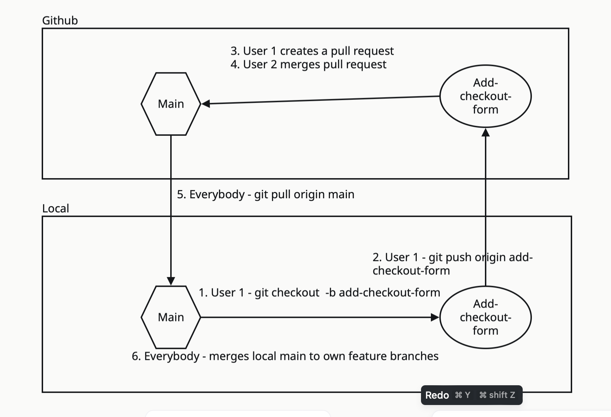

# Note Taking App

This project is designed to give you some practice with building a react project ina  group. For this project we have provided the outline of the project, to demonstrate what material you'll need to plan out when working on a project from scratch.

You will have 3 days to work on the project in groups of 3-4. 

Please read through the entire document together before starting your work!

## Instructions

1. Choose a member of the group to create a new Github repo with a react project in it's root
2. Deploy your website to `Netlify` or another service if needed
3. Have each member of the group `pull` to create their own local version of the repo. **Don't Fork!**
4. Each member of the group should work on a feature (form, index page, show page, etc.) in a separate branch.
5. Once a feature is completed - 
    * The user should push the branch up to github and create a pull request
    * A different user on the should review, approve and merge the pull request, and alert the rest of the team members about it
    * All team members should pull from the remote main to their local main
    * All team members should merge their local main into their feature branches
    * The completed feature branch should get deleted
    
6. Finish all basic features first. Before moving to stretch goals, ask a coach for approval!
7. Add a [readme](https://github.com/othneildrew/Best-README-Template/edit/master/README.md#built-with) to your project (Yes, that should be it's on feature on it's own branch)
8. Submit the link to the completed project on Canvas

## User Stories

### Basic

* As a user, I want to be able to create new notes so that I can jot down my ideas or important information.
* As a user, I want to view my existing notes so that I can see what I've written previously.
* As a user, I want to edit the content of my notes so that I can make changes or corrections as needed.
* As a user, I want to delete notes that are no longer relevant or needed and be redirected to the notes index page after a successful deletion.
* As a user, I want a navigation bar with links to the form page, home page, and an about us page for easy navigation.
* As a user, I want to categorize my notes so that I can organize them based on different topics or subjects.
* As a user, I want to search for notes by title or content so that I can quickly find the information I need. I want the search to update as I type.
* As a user I want to be able to see information about the developers of the app on an about us page

### Stretch 

* As a user, I want to add tags to my notes so that I can easily identify and filter them based on specific keywords or themes.
* As a user, I want to filter my notes by category or tag so that I can focus on specific sets of notes at a time.
* As a user I want to receive clear error messages when needed.

## Wire Frames

> These wire frames are for the basic version of the app. They are low fidelity so you can choose your own design. Make sure design is consistent across all pages.

[Link](https://www.figma.com/file/o4Ci5ezn6OmP0yW7TaAAvS/Note-Taking-App-Wireframes?type=whiteboard&node-id=0%3A1&t=mRFyOdRJO0xsg5dB-1)

## Frontend Routes, React Components & Views

> Note: This section will outline the routes and their corresponding React components. Meaning just the components that are a whole page/view. You can have more react components nested inside them if needed!

`/notes - <NotesList> (index/home page)`
`/notes/:id - <Note> (show)`
`/notes/new - <NewNoteForm> (new)`
`/notes/:id/edit - <EditNoteForm> (edit)`
`/about - <AboutUs> (information about the team)`
## Backend Routes

> These routes will be connected to a fake backend, be mindful that data will not persist in the backend!

`BASE_URL https://my-json-server.typicode.com/RazEfron/demo`

`POST /notes (create)`

`GET /notes (read)`

`GET /notes/:id (read)`

`PUT/PATCH /notes/:id (update)`

`DELETE /notes/:id (delete)`

## Technologies

> List any other technologies you choose to use

* CSS
* React
* React Router Dom 

## Stretch Goals

* Not a user story but a stretch goal - Have one form for new and edit functionalities.
* Add a 404 page for non existing routes
* Add responsive design for different screen sizes

## Guidelines and Tips

* Commit a lot and have your commit messages long and descriptive. Error on the side of over committing and too long messages!
* Check that your live site is working after every new feature is merged to main
* Pair program on challenging features if needed
* When you're stuck, don't be proud, be a good team member and reach out to your other team members and coach
* Use older projects like the student-dashboard as a reference
* Plan a road map of which features you tackle first and finish them before moving to new ones